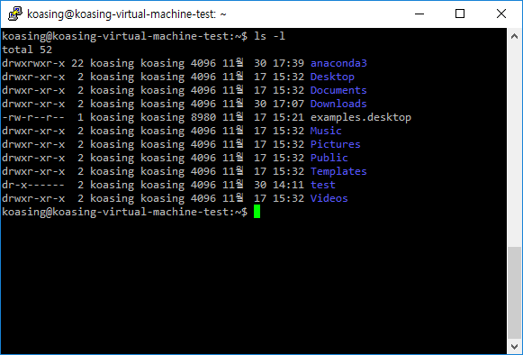

Shell
=====

A black-and-white Command Line Interface (CLI).

- [Shell](#shell)
    - [Disambiguous](#disambiguous)
    - [bash](#bash)
    - [Shell Prompt](#shell-prompt)
    - [Change Directory](#change-directory)
    - [List Segments](#list-segments)
    - [Execute File](#execute-file)
    - [Alternatives](#alternatives)

Disambiguous
------------

- Terminal : a physical devices that interacts with user.
- Console : a pair of input and output devices.
- Shell : a program that processes commands.


bash
----
Most linux dists uses bash - Bourne-again shell - as that user's default shell.



After user login, Linux system executes that user's shell as interactive mode.
If shell is not executed (or terminated immediately), that user can do nothing.


Shell Prompt
------------
Shell prompt displays some informations about current session. By default, it
looks like:

```
koasing@koasing-virtual-machine-test:/home$ █
------- ---------------------------- ------ -
   1                  2                3  4 5
```

- 1 : username
- 2 : hostname
- 3 : current directory.
- 4 : user mark (normal user `$` / superuser `#`)
- 5 : cursor (usually omitted)

Prompt format can be changed. For example, Anaconda3 adds its envname in front
of default prompt.

```console
koasing@koasing-virtual-machine-test:~$ source activate py35
(py35) koasing@koasing-virtual-machine-test:~$
```

Many documents, including this, abbreviates shell prompt to user mark for
simplicity. For example, the image above is usually written as:

```console
$ ls -l
total 52
drwxrwxr-x 22 koasing koasing 4096 11월 30 17:39 anaconda3
... blahblah ...
```


Change Directory
----------------

To check current working directory, use `pwd` (print working directory).

```console
$ pwd
/home/koasing
```

To change working directory, use `cd` (change directory).

```console
~$ cd Downloads
~/Downloads$ 
```

Current directory is referred as `.` (single dot).
Parent directory is referred as `..` (double dot).
The user's home directory (usually `/home/<username>`) is referred as `~`
(tilde). 

```console
~/Downloads$ cd .
~/Downloads$ pwd
/home/koasing/Downloads
~/Downloads$ cd ..
~$ pwd
/home/koasing
~$ cd /etc
/etc$ pwd
/etc
/etc$ cd ~
~$ pwd
/home/koasing
```

In some cases, grandparent directory could be referred as `...` (triple dot),
and so on, but it is not a standard way.


List Segments
-------------

To list segments of specific directory, use `ls [path]`. Segment is linux
internal structure, including files, directory, devices, pipe, and so on.

If `[path]` is omitted, current directory is used.

```console
$ ls .
anaconda3  Documents  examples.desktop  Pictures  Templates  Videos
Desktop    Downloads  Music             Public    test
$ ls
anaconda3  Documents  examples.desktop  Pictures  Templates  Videos
Desktop    Downloads  Music             Public    test
$ ls /
bin    dev   initrd.img      lib64       mnt   root  snap  tmp  vmlinuz
boot   etc   initrd.img.old  lost+found  opt   run   srv   usr  vmlinuz.old
cdrom  home  lib             media       proc  sbin  sys   var
```

To see detailed list, append `-l` (long).

```console
$ ls -l
total 52
drwxrwxr-x 22 koasing koasing 4096 11월 30 17:39 anaconda3
drwxr-xr-x  2 koasing koasing 4096 11월 17 15:32 Desktop
drwxr-xr-x  2 koasing koasing 4096 11월 17 15:32 Documents
drwxr-xr-x  2 koasing koasing 4096 11월 30 17:07 Downloads
-rw-r--r--  1 koasing koasing 8980 11월 17 15:21 examples.desktop
drwxr-xr-x  2 koasing koasing 4096 11월 17 15:32 Music
drwxr-xr-x  2 koasing koasing 4096 11월 17 15:32 Pictures
drwxr-xr-x  2 koasing koasing 4096 11월 17 15:32 Public
drwxr-xr-x  2 koasing koasing 4096 11월 17 15:32 Templates
drwxr-xr-x  2 koasing koasing 4096 12월  1 16:29 test
drwxr-xr-x  2 koasing koasing 4096 11월 17 15:32 Videos
```

To see hidden segments, append `-a` (all)

```console
$ ls -a
.                      .dmrc             .profile
..                     Documents         Public
anaconda3              Downloads         .python_history
.bash_history          examples.desktop  .ssh
.bash_logout           .gconf            .sudo_as_admin_successful
.bashrc                .gnupg            Templates
.bashrc-anaconda3.bak  .ICEauthority     test
.cache                 .local            Videos
.compiz                .mozilla          .Xauthority
.conda                 Music             .xsession-errors
.config                .nano             .xsession-errors.old
Desktop                Pictures
```

The options could be combined like `-al`.

```conosle
$ ls -al
total 148
drwxr-xr-x 22 koasing koasing 4096 11월 30 17:48 .
drwxr-xr-x  3 root    root    4096 11월 17 15:21 ..
drwxrwxr-x 22 koasing koasing 4096 11월 30 17:39 anaconda3
-rw-------  1 koasing koasing 5264 11월 30 17:51 .bash_history
-rw-r--r--  1 koasing koasing  220 11월 17 15:21 .bash_logout
-rw-r--r--  1 koasing koasing 3851 11월 30 17:36 .bashrc
-rw-r--r--  1 koasing koasing 3771 11월 30 10:25 .bashrc-anaconda3.bak
drwx------ 11 koasing koasing 4096 11월 30 10:19 .cache
... blahblah ...
```


Execute File
------------
By default, Linux does not recognize executables in current directory.
This is big difference with Windows command prompt.

To execute a file in current directory, append `./` in front of filename to
make clear that the file is placed in current directory.

```console
$ ls -al
total 12
drwxr-xr-x  2 koasing koasing 4096 12월  1 16:29 .
drwxr-xr-x 22 koasing koasing 4096 11월 30 17:48 ..
-rwxrw-r--  1 koasing koasing   38 12월  1 16:29 test.sh
$ test.sh
test.sh: command not found
$ ./test.sh
Hello bash!
```


Alternatives
------------
- sh : Bourne shell. bash's ancestor.
- ash
    - dash
- bash
    - ksh
    - zsh
- csh
- disabled shell
    - false
    - nologin