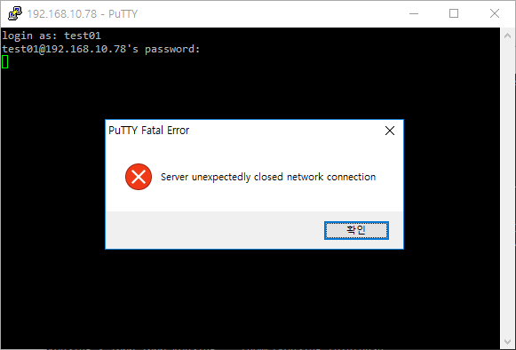

User and Group Management
=========================

Linux is multi-user operating system.

- [User and Group Management](#user-and-group-management)
    - [Manage User](#manage-user)
        - [Create a new User](#create-a-new-user)
        - [Disable and Enable a User](#disable-and-enable-a-user)
        - [Remove a User](#remove-a-user)
    - [Manage Group](#manage-group)
        - [List User's Groups](#list-users-groups)
        - [Create and Remove Group](#create-and-remove-group)
        - [Add User to Group](#add-user-to-group)
        - [Remove User from Group](#remove-user-from-group)
        - [Primary and Supplementary Group](#primary-and-supplementary-group)
    - [Sudoers](#sudoers)

Manage User
-----------

### Create a new User

Issue `adduser <username>` as superuser.

For security reason, password is never displayed in console.

```console
$ sudo adduser test01
Adding user `test01' ...
Adding new group `test01' (1001) ...
Adding new user `test01' (1001) with group `test01' ...
Creating home directory `/home/test01' ...
Copying files from `/etc/skel' ...
Enter new UNIX password:
Retype new UNIX password:
passwd: password updated successfully
Changing the user information for test01
Enter the new value, or press ENTER for the default
        Full Name []: Testuser
        Room Number []:
        Work Phone []:
        Home Phone []:
        Other []:
Is the information correct? [Y/n] y
$ ls -al /home
total 16
drwxr-xr-x  4 root    root    4096 12월  4 13:37 .
drwxr-xr-x 24 root    root    4096 11월 30 10:20 ..
drwxr-xr-x 23 koasing koasing 4096 12월  4 11:42 koasing
drwxr-xr-x  2 test01  test01  4096 12월  4 13:37 test01
```

A new home directory for new user is created, and files in `/etc/skel` is
automatically copied into the new home directory.


### Disable and Enable a User

To disable a user, issue `usermod --expiredate 1 <username>` as superuser. It
expires the user after 1st day of Unix calendar (1-Jan-1970).

```console
$ sudo usermod --expiredate 1 test01
```

Nothing is printed, but that account is locked.



To re-enable a locked user, issue `usermod --expiredate "" <username>` as su.
The user will be expired after undetermined date- or never expire.


### Remove a User

**WARNING** This is destructive opeation. Proceed with caution! Usually just
disabling the user is sufficient.

Issue `deluser <username>` as superuser. By default, the files user has created
are kept. To remove home directory, use `--remove-home` option.

```console
$ sudo deluser --remove-home test01
Looking for files to backup/remove ...
Removing files ...
Removing user `test01' ...
Warning: group `test01' has no more members.
Done.
$ ls -al /home
total 12
drwxr-xr-x  3 root    root    4096 12월  4 13:48 .
drwxr-xr-x 24 root    root    4096 11월 30 10:20 ..
drwxr-xr-x 23 koasing koasing 4096 12월  4 11:42 koasing
```


Manage Group
------------

### List User's Groups

Use `groups [username]` command. If username is omitted, current user's groups
are listed.

```console
$ groups
koasing adm cdrom sudo dip plugdev lpadmin sambashare
$ groups koasing
koasing : koasing adm cdrom sudo dip plugdev lpadmin sambashare
$ groups test01
test01 : test01
```


### Create and Remove Group

To create a group, issue `addgroup <groupname>` as superuser.  
To remove a group, issue `delgroup <groupname>` as superuser.

Group cannot be removed if that group has members. Remove all group members
before removing group.


### Add User to Group

Issue `adduser <username> <group>` as superuser. The modification will be
effective after next session. (re-login required.)

This command adds supplementary group.

```console
$ groups
koasing adm cdrom sudo dip plugdev lpadmin sambashare
$ sudo adduser koasing test01
Adding user `koasing' to group `test01' ...
Adding user koasing to group test01
Done.
$ groups
koasing adm cdrom sudo dip plugdev lpadmin sambashare

** after re-login **
$ groups
koasing adm cdrom sudo dip plugdev lpadmin sambashare test01
```


### Remove User from Group

Issue `deluser <username> <group>` as superuser. The modification will be
effective after next session. (re-login required.)

```console
$ groups
koasing adm cdrom sudo dip plugdev lpadmin sambashare test01
$ sudo deluser koasing test01
Removing user `koasing' from group `test01' ...
Done.
$ groups
koasing adm cdrom sudo dip plugdev lpadmin sambashare test01

** after re-login **
$ groups
koasing adm cdrom sudo dip plugdev lpadmin sambashare
```


### Primary and Supplementary Group

rouglhy,

- Primary group : used for Group Ownership of newly created file.
- Supplementary group : used to check user's access priviledge.


Sudoers
-------

By default, Ubuntu does not allow to login as root for security reason.
To do system administrative jobs, the user could use `sudo`.
To use `sudo`, that user should be member of `sudo` or `admin` group.
The members of `sudo` groups are called **sudoer**s.

To give administrative priviledge to a user, issue `adduser <username> sudo` as
superuser.
