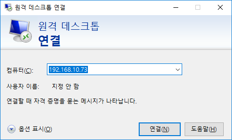
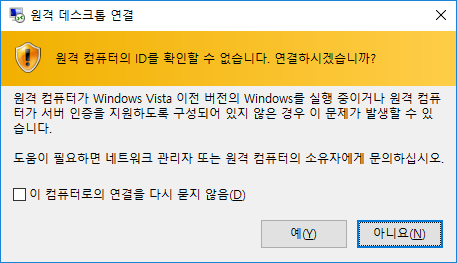
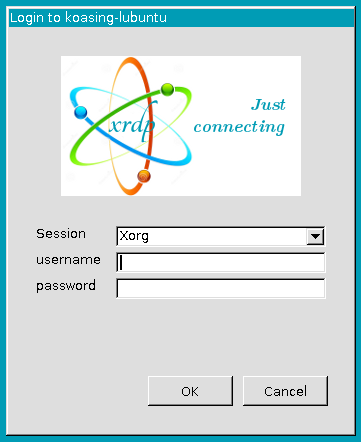
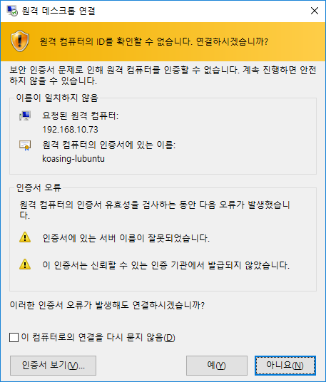

Enabling RDP Service
====================

RDP : Remote Desktop Protocol (MS Proprietary)



Prerequest
----------

It is highly recommended to use Lubuntu if RDP Service is required, because
Ubuntu's default Windows Manager, Unity, is incompatible with xrdp.
Lubuntu uses LXDE instead of Unity, which is compatible with xrdp.

Security Concerns
-----------------

RDP uses TLS to secure your connection.

Please be aware that you SHOULD type your password to connect RDP session, which
may be a security weakness. (key-pair connection is not supported)

Setup
-----

### Install xrdp

Do as superuser.

```console
# apt-get install xrdp
blahblah
```

### Edit Xwrapper setting

Ref: <http://c-nergy.be/blog/?p=10887>

Since Ubuntu 17.10, Xwrapper binary is restricted to be executed in hardware
console only. To solve this problem, edit `/etc/X11/Xwrapper.config`.

Change `allowed_user=console` to `allowed_user=anybody`.

### Create `.xsession` file

Create this file for each user who want to use RDP session. Additionally, you
may create the file in `/etc/skel` to enable for new users.

This example uses LXDE as Window Manager, which is default Lubuntu WM.
If the user wants to use other WM, the user should edit the file.

```console
$ touch ~/.xsession
$ echo lxsession -s Lubuntu -e LXDE > ~/.xsession
```

### Connect using RDP

On Windows PC, execute `mstsc` then input server's IP.
Because the server have no certificate, warning message occurs. Press Yes.



xrdp session manager is opened. Input your **username** and **password** to
login.



The session is still running even you close RDP client, like Winodws RDP.
The session terminates only when you press Logout button, or kill lxsession
process.

### Create server certificates

On linux server, do as root. **Common Name** will be displayed while connecting.

```console
# cd /etc/xrdp
# ls -al *.pem
lrwxrwxrwx  1 root root 34 12월  6 15:35 cert.pem --> /etc/ssl/certs/ssl-cert-snakeoil.pem
lrwxrwxrwx  1 root root 34 12월  6 15:35 key.pem --> /etc/ssl/private/ssl-cert-snakeoil.pem
# rm *.pem
# openssl req -x509 -newkey rsa:2048 -nodes -keyout key.pem -out cert.pem -days 3650
Generating a 2048 bit RSA private key
..............................................................................................+++
...........................................+++
unable to write 'random state'
writing new private key to 'key.pem'
-----
You are about to be asked to enter information that will be incorporated
into your certificate request.
What you are about to enter is what is called a Distinguished Name or a DN.
There are quite a few fields but you can leave some blank
For some fields there will be a default value,
If you enter '.', the field will be left blank.
-----
Country Name (2 letter code) [AU]:KR
State or Province Name (full name) [Some-State]:Seoul
Locality Name (eg, city) []:
Organization Name (eg, company) [Internet Widgits Pty Ltd]:koasing-lubuntu
Organizational Unit Name (eg, section) []:
Common Name (e.g. server FQDN or YOUR name) []:koasing-lubuntu
Email Address []:
# chown xrdp:root *.pem
# chmod 644 cert.pem
# chmod 600 key.pem
# service xrdp restart
```

Try to connect. Warning messange occurs because the certificate is self-signed.




Limitation
----------

If you open graphic session on both console and RDP, they works independently,
and Logout button at the top-right corner of screen does not work properly.
In this case, use `lxsession-logout` command to open logout menu.

To access console session through RDP, use VNC.
