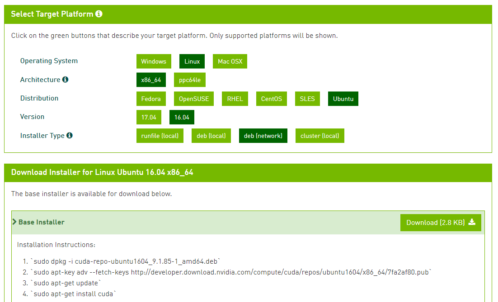
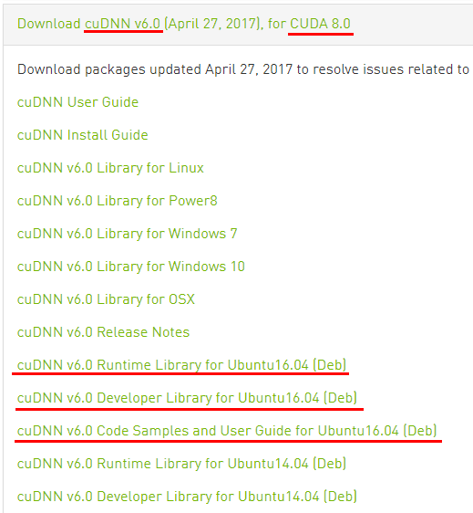

- [CUDA-8.0](#cuda-80)
    - [설치 전 준비사항](#%EC%84%A4%EC%B9%98-%EC%A0%84-%EC%A4%80%EB%B9%84%EC%82%AC%ED%95%AD)
        - [gcc](#gcc)
        - [uname](#uname)
        - [커널 소스](#%EC%BB%A4%EB%84%90-%EC%86%8C%EC%8A%A4)
    - [CUDA 다운로드](#cuda-%EB%8B%A4%EC%9A%B4%EB%A1%9C%EB%93%9C)
    - [CUDA 설치](#cuda-%EC%84%A4%EC%B9%98)
    - [CUDA 설치 확인](#cuda-%EC%84%A4%EC%B9%98-%ED%99%95%EC%9D%B8)
    - [CUDA 9.x도 설치하려면?](#cuda-9x%EB%8F%84-%EC%84%A4%EC%B9%98%ED%95%98%EB%A0%A4%EB%A9%B4)
- [cuDNN-6.0](#cudnn-60)
    - [cuDNN 다운로드](#cudnn-%EB%8B%A4%EC%9A%B4%EB%A1%9C%EB%93%9C)
    - [cuDNN 설치](#cudnn-%EC%84%A4%EC%B9%98)
    - [cuDNN 설치 확인](#cudnn-%EC%84%A4%EC%B9%98-%ED%99%95%EC%9D%B8)
    - [cuDNN-7.x도 설치하려면?](#cudnn-7x%EB%8F%84-%EC%84%A4%EC%B9%98%ED%95%98%EB%A0%A4%EB%A9%B4)

-----

CUDA-8.0
========

이 섹션은 System-wide 설정을 다루므로, 서버 설치가 필요할 때마다 한 번씩 수행하면 된다.

**주의사항** Tensorflow 1.4 기준, CUDA 8.0 + cuDNN 6.0 을 사용한다.

설치 전 준비사항
----------------

### gcc

```console
$ sudo apt-get install build-essential
... blahblah ...
$ gcc --version
gcc (Ubuntu 5.4.0-6ubuntu1~16.04.5) 5.4.0 20160609
Copyright (C) 2015 Free Software Foundation, Inc.
This is free software; see the source for copying conditions.  There is NO
warranty; not even for MERCHANTABILITY or FITNESS FOR A PARTICULAR PURPOSE.
```

### uname

- 오류나면 리눅스가 박살난 것이므로 포맷하고 다시 설치한다.
- -r 옵션은 커널버전을, -m 옵션은 아키텍쳐를 보여준다. 아키텍쳐가 x86_64 임을 확인.

```console
$ uname -r
4.10.0-28-generic
$ uname -m
x86_64
```

### 커널 소스

- 대부분 이미 설치되어 있다.

```console
$ sudo apt-get install linux-headers-$(uname -r)
... blahblah ...
```

CUDA 다운로드
-------------

- 사실 이건 저장소 데이터만 담고 있는 메타파일이다. 그냥 최신 버전 다운받아도 된다.
- <https://developer.nvidia.com/cuda-downloads> 접속
- **Linux** - **x86_64** - **Ubuntu** - **16.04** - **deb (network)** 다운로드한다.
- 다운로드 아래에 설치 방법도 같이 안내된다.



- WinSCP 같은 sftp 클라이언트로 서버에 업로드한다. 업로드 위치는 `~/cuda_lib` 추천
- 아니면 파일 경로를 복사해서 콘솔에서 `wget <url>` 치면 서버에서 직접 다운로드 받을 수도 있다.

CUDA 설치
---------

```console
$ sudo dpkg -i cuda-repo-ubuntu1604_9.1.85-1_amd64.deb
Selecting previously unselected package cuda-repo-ubuntu1604.
(Reading database ... 122972 files and directories currently installed.)
Preparing to unpack cuda-repo-ubuntu1604_9.1.85-1_amd64.deb ...
Unpacking cuda-repo-ubuntu1604 (9.1.85-1) ...
Setting up cuda-repo-ubuntu1604 (9.1.85-1) ...

The public CUDA GPG key does not appear to be installed.
To install the key, run this command:
sudo apt-key adv --fetch-keys http://developer.download.nvidia.com/compute/cuda/repos/ubuntu1604/x86_64/7fa2af80.pub
```

- 레포지터리 추가되면서 인증키를 같이 설치하라고 안내가 뜬다.
  해당 명령을 그대로 복사해서 실행하면 된다.
- 이후 apt update 한 뒤 CUDA 8.0을 설치한다.
- CUDA 라이브러리 설치하면서 NVIDIA 최신 드라이버도 같이 설치된다.

```console
$ sudo apt-key adv --fetch-keys http://developer.download.nvidia.com/compute/cuda/repos/ubuntu1604/x86_64/7fa2af80.pub
Executing: /tmp/tmp.EFlKvS9P0R/gpg.1.sh --fetch-keys
http://developer.download.nvidia.com/compute/cuda/repos/ubuntu1604/x86_64/7fa2af80.pub
gpg: key 7FA2AF80: public key "cudatools <cudatools@nvidia.com>" imported
gpg: Total number processed: 1
gpg:               imported: 1  (RSA: 1)
$ sudo apt-get update
... blahblah ...
$ sudp apt-get install cuda-8-0
... blahblah ... very many packages ...
$ sudo apt-get install libcupti-dev
... blahblah ...
```

- 설치가 끝나면 `~/.bashrc` 파일을 수정해 준다. 맨 마지막에 다음 내용을 추가한다.
- `/etc/skel/.bashrc` 파일에도 추가해 주면 향후 추가되는 새 유저에게도 자동으로 적용된다.
  이 파일을 수정하려면 sudo 로 작업해야 한다.

```bash
# CUDA libraries
CUDA_HOME=/usr/local/cuda
PATH=${CUDA_HOME}/bin${PATH:+:${PATH}}
LD_LIBRARY_PATH=${CUDA_HOME}/lib64${LD_LIBRARY_PATH:+:${LD_LIBRARY_PATH}}
```

- 이후 재부팅 해 준다.

**참고**

- 메타패키지는 버전이 올라가면 자동으로 업그레이드 된다. **cuda** 패키지를 설치하면 현재까지 발표된
  가장 최신버전을 설치하므로 주의. **cuda-8-0** 메타패키지를 설치하면 8.0 중 최신버전을 설치한다.
- 향후 텐서플로가 업그레이드 되어서 9.x를 요구한다면 **cuda-9-x** 패키지를 설치하면 된다.
- 패키지 목록은 `apt-cache search` 명령어로 찾을 수 있다.

```console
$ sudo apt-cache search cuda | grep meta-package
cuda-8-0 - CUDA 8.0 meta-package
cuda-9-0 - CUDA 9.0 meta-package
cuda-9-1 - CUDA 9.1 meta-package
...
cuda - CUDA meta-package
```

CUDA 설치 확인
--------------

```console
$ nvidia-smi
+-----------------------------------------------------------------------------+
| NVIDIA-SMI 387.26                 Driver Version: 387.26                    |
|-------------------------------+----------------------+----------------------+
| GPU  Name        Persistence-M| Bus-Id        Disp.A | Volatile Uncorr. ECC |
| Fan  Temp  Perf  Pwr:Usage/Cap|         Memory-Usage | GPU-Util  Compute M. |
|===============================+======================+======================|
|   0  GeForce GTX 108...  Off  | 00000000:01:00.0 Off |                  N/A |
|  0%   45C    P5    24W / 320W |     35MiB / 11172MiB |      0%      Default |
+-------------------------------+----------------------+----------------------+

+-----------------------------------------------------------------------------+
| Processes:                                                       GPU Memory |
|  GPU       PID   Type   Process name                             Usage      |
|=============================================================================|
|    0       894      G   /usr/lib/xorg/Xorg                            33MiB |
+-----------------------------------------------------------------------------+
$ cuda-install-samples-8.0.sh ~
Copying samples to /home/koasing/NVIDIA_CUDA-8.0_Samples now...
Finished copying samples.
$ cd ~/NVIDIA_CUDA-8.0_Samples/1_Utilities/deviceQuery
$ make
...
$ ./deviceQuery
./deviceQuery Starting...

 CUDA Device Query (Runtime API) version (CUDART static linking)

Detected 1 CUDA Capable device(s)

Device 0: "GeForce GTX 1080 Ti"
...

deviceQuery, CUDA Driver = CUDART, CUDA Driver Version = 9.1, CUDA Runtime Version = 8.0, NumDevs = 1, Device0 = GeForce GTX 1080 Ti
Result = PASS
```

CUDA 9.x도 설치하려면?
----------------------

- CUDA 라이브러리는 여러 버전을 동시에 설치할 수 있다.
- 이 경우, `/usr/local/cuda-8.0`, `/usr/local/cuda-9.1` 과 같이 버전별로 디렉터리가 구성되며,
  대표 라이브러리는 `/usr/local/cuda` 디렉터리로 링크된다.
- 사용하려는 텐서플로에서 요구하는 버전에 맞추어 ~/.bashrc 파일의 $CUDA_HOME 경로를 수정해 준다.
- 근데 대표 라이브러리의 버전이 안 맞아도, 설치만 되어 있다면 알아서 찾아가는 것 같다.

-----

cuDNN-6.0
=========

이 섹션은 System-wide 설정을 다루므로, 서버 설치가 필요할 때마다 한 번씩 수행하면 된다.

cuDNN 다운로드
--------------

- NVIDIA 개발자 등록해야 다운로드 받을 수 있다. 아니면 옆사람에게서 복사해 오던지.
- <https://developer.nvidia.com/rdp/cudnn-download> 에서 다운로드. 아쉽지만 `wget`은 못 쓴다.
- **cuDNN v6.0, for CUDA 8.0** 확인할 것. 향후 텐서플로가 업데이트 되면 그 버전에 맞게 다운로드 받는다.
- **Ubuntu 16.04 (Deb)** 확인할 것. 14.04나 Power8 용을 받으면 안된다.
- **Runtime Library**, **Developer Library**, **Code Samples** 세 개를 모두 다운로드 받는다.
- 설치 방법은 Install Guide를 보면 나온다.



- 다운로드 받은 파일을 DNN 서버로 업로드 한다.

cuDNN 설치
----------

```console
$ sudo dpkg -i libcudnn6_6.0.21-1+cuda8.0_amd64.deb
... blahblah ...
$ sudo dpkg -i libcudnn6-dev_6.0.21-1+cuda8.0_amd64.deb
... blahblah ...
$ sudo dpkg -i libcudnn6-doc_6.0.21-1+cuda8.0_amd64.deb
... blahblah ...
```

**참고**
- cuDNN 라이브러리는 debian package 파일로 수동 설치하므로, apt로 업데이트가 되지 않는다.
- 업데이트된 라이브러리가 공개되면 수동으로 다시 받아서 dpkg로 설치해 주면 된다. 알아서 덮어씌운다.
- 설치할 때, 사용하려는 텐서플로 버전이 맞는지 재확인 할 것.
- cuDNN 라이브러리는 여러 버전을 동시에 설치할 수 있다.

cuDNN 설치 확인
---------------

```console
$ cp -r /usr/src/cudnn_samples_v6 ~
$ cd ~/cudnn_samples_v6/mnistCUDNN
$ make
...
$ ./mnistCUDNN
cudnnGetVersion() : 6021 , CUDNN_VERSION from cudnn.h : 6021 (6.0.21)
Host compiler version : GCC 5.4.0
There are 1 CUDA capable devices on your machine :
device 0 : sms 28  Capabilities 6.1, SmClock 1721.0 Mhz, MemSize (Mb) 11172, MemClock 5505.0 Mhz, Ecc=0, boardGroupID=0
Using device 0

Testing single precision
...
Test passed!

Testing half precision (math in single precision)
...
Test passed!
```

cuDNN-7.x도 설치하려면?
-----------------------

- cuDNN 라이브러리는 여러 버전을 동시에 설치할 수 있다.
- 이 경우, `/usr/lib/x86_64-linux-gnu` 디렉터리에 `libcudnn*.v6`, `libcudnn*.v7` 과 같이 버전별로
  파일이 존재하게 되며, 대표 라이브러리는 `/etc/alternatives` 로 링크된다.
- 대표 버전을 변경하려면 `sudo update-alternatives --config libcudnn` 명령어를 실행한다.
- 근데 버전 안 맞아도 설치만 되어 있다면 알아서 찾아가는 것 같다.
