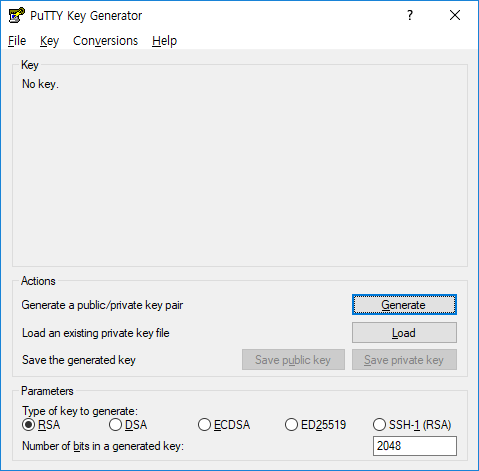
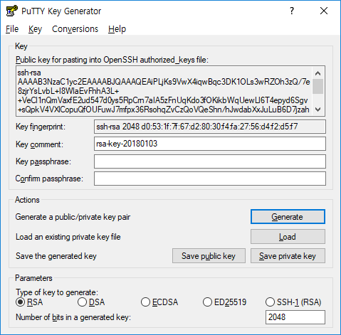
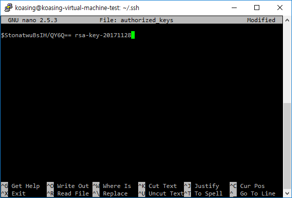

- [SSH 원격접속 및 Key-pair 로그인](#ssh-%EC%9B%90%EA%B2%A9%EC%A0%91%EC%86%8D-%EB%B0%8F-key-pair-%EB%A1%9C%EA%B7%B8%EC%9D%B8)
    - [PuTTY 설치](#putty-%EC%84%A4%EC%B9%98)
    - [원격접속 해 보기](#%EC%9B%90%EA%B2%A9%EC%A0%91%EC%86%8D-%ED%95%B4-%EB%B3%B4%EA%B8%B0)
        - [트러블슈팅](#%ED%8A%B8%EB%9F%AC%EB%B8%94%EC%8A%88%ED%8C%85)
    - [SSH Key-pair 만들기](#ssh-key-pair-%EB%A7%8C%EB%93%A4%EA%B8%B0)
    - [authorized_keys 파일 만들기](#authorizedkeys-%ED%8C%8C%EC%9D%BC-%EB%A7%8C%EB%93%A4%EA%B8%B0)
    - [Key-pair 로그인 해 보기](#key-pair-%EB%A1%9C%EA%B7%B8%EC%9D%B8-%ED%95%B4-%EB%B3%B4%EA%B8%B0)
    - [Key agent 자동 실행](#key-agent-%EC%9E%90%EB%8F%99-%EC%8B%A4%ED%96%89)
- [WinSCP](#winscp)

SSH 원격접속 및 Key-pair 로그인
===============================

PuTTY 설치
----------

기본적으로 윈도우에는 SSH 클라이언트가 없다.
[PuTTY](https://www.chiark.greenend.org.uk/~sgtatham/putty/latest.html) 를 설치한다.
아니면 다른걸 설치해도 된다. [MobaXterm](https://mobaxterm.mobatek.net/) 같은거.


원격접속 해 보기
----------------

- 일단 PuTTY 실행해 본다.
- 서버관리자에게 IP와 포트번호를 전달받아서 입력한다. 다른 옵션은 기본값 써도 된다.


- RSA Fingerprint 확인하라는 경고가 뜨면 서버관리자에게 확인해 본 뒤 Yes를 누른다.
  서버가 탈취당하거나 하면 지문값이 바뀌었다고 경고가 뜨므로 서버관리자에게 문의해 볼 것.
- 계정명과 암호(아마 서버 관리자가 임의로 만들어서 알려줬을 것이다.)를 입력하면
  검은 화면에 흰 글씨로 콘솔 창이 뜬다.


- 이제 비밀번호를 변경한다. 암호는 가급적 길고 복잡한게 좋다.

```console
$ passwd
Changing password for koasing.
(current) UNIX password:
Enter new UNIX password:
Retype new UNIX password:
passwd: password updated successfully
```

- 다 했으면 PuTTY를 종료한 다음 다시 접속해 본다. 암호를 까먹으면 관리자가 싫어한다.
- 밑에서 해야 할 작업이 있으미 PuTTY는 그대로 띄워두자.

### 트러블슈팅

- ID 입력창도 보이지 않고 접속이 끊긴다.
  : 대부분 방화벽에서 차단먹은 것이다. 내 컴퓨터의 IP와 서버 방화벽 설정을 확인해 본다.
- ID 입력창은 보이는데 로그인이 안 된다.
  : 대부분 비밀번호 입력을 틀린거다. 비밀번호를 확인해 본다.
- ID 입력하니 agent 어쩌고 하면서 바로 로그인이 된다.
  : 설정 다 되어 있는데 이 문서를 왜 보고 있어요?


SSH Key-pair 만들기
-------------------

기본적으로 ID-암호 로그인 방식을 사용하지만, 이 방법은 앞으로 쓰게 될 DNN 원격실행 과정에는 적합하지
않다. 암호를 PyCharm에 입력해서 보관해야 하기 때문이다.

다행히, 수학자들이 이를 해결할 방법을 개발해 두었다. 비대칭 키를 이용한 Key-pair 인증이다.
자세한 수학 이론은 구글에 검색해 볼 것. 그냥 그런게 있다. 공인인증서도 Key-pair 인증 중 하나이다.

비대칭 키 암호화에서는 서로 대응하는 2개의 키가 만들어진다.
이 중 공개키는 외부에 알려줘도 되는 키이고 개인키는 공개되면 안 되는 키이다.

**개인키는 서버 암호를 대체하며, 완전히 똑같은 역할을 하므로 조심해서 관리할 것.**

- 시작메뉴에서 `PuTTYgen` 찾아 실행한다.
- 하단에서 **RSA**, **2048** 입력된 것을 확인하고 Generate 클릭
- 빈 공간에서 마우스를 움직이라고 뜰 것이다. Randomness를 주기 위함이니 마우스를 마구 움직여 준다.



- 잠시 뒤 새롭게 키가 생성될 것이다. Key comment에 알아보기 쉬운 이름을 달아준다.
- Key passpharase는 **개인키 고유 암호**이다. 이를테면 공인인증서 비밀번호. **서버 암호**와 다르다.
- **개인키 고유 암호**를 입력한 Save private key 를 눌러서 개인키를 적절한 곳에 저장한다.
- 아직 창을 닫지는 말고 잠시 띄워둘 것. 성급하게 닫아버렸다면 File - Load private key 로 불러온다.




authorized_keys 파일 만들기
---------------------------

- 다시 PuTTY 창으로 돌아간다.
- Key-pair 기반 로그인을 설정한다.

```console
$ mkdir ~/.ssh
$ chmod 700 ~/.ssh
$ touch ~/.ssh/authorized_keys
$ chmod 600 ~/.ssh/authorized_keys
$ nano ~/.ssh/authorized_keys
```


- `nano` 편집기가 실행되면, PuTTYgen 에 떠 있는 `ssh-rsa`로 시작하는 텍스트를 붙여넣기 해야 한다.
- 한 글자라도 빼먹으면 안 되므로, 팝업 메뉴에서 모두선택을 눌러서 붙여넣기 한다.
- 기본 설정인 상태라면, PuTTY 창에서 마우스 오른쪽 버튼을 클릭하면 클립보드 내용이 붙여넣기 된다.



- 엔터 한 번 쳐서 줄바꿈을 넣어주고, Ctrl+O 로 저장한 뒤 Ctrl+X 로 `nano` 를 종료한다.


Key-pair 로그인 해 보기
-----------------------

- 키를 보관해 주는 `Pageant` 프로그램을 실행하고, Add key를 눌러서 개인키를 불러온다.
- 아니면 개인키 파일을 더블클릭해도 된다.


- 이제 PuTTY 로 ssh 접속해 본다. 비밀번호 입력을 건너뛰고 로그인에 성공하면 설정 완료.


- 이제 `Pageant`가 실행되어 있고, 적절한 개인키가 적재되어 있다면 호환되는 모든 프로그램에서
  Key-pair 기반 로그인이 가능하다.
- 호환되는 대표적인 프로그램으로는 PyCharm, SourceTree, WinSCP 등이 있다.


Key agent 자동 실행
-------------------

누군가 추가하겠지

-----

WinSCP
======

SSH는 부가적으로 SFTP라고 하는 파일전송 기능도 지원한다.
이걸 편하게 쓸 수 있는 프로그램이 [WinSCP](https://winscp.net/ko/) 이다.

설치및 사용방법은 누군가 추가하겠지

- Key-pair 인증을 지원하므로, Agent 실행되어 있는 상황에서는 password 를 비워두고 로그인하면 된다.
